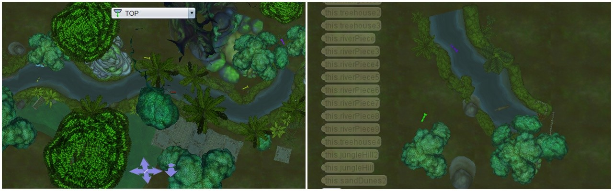
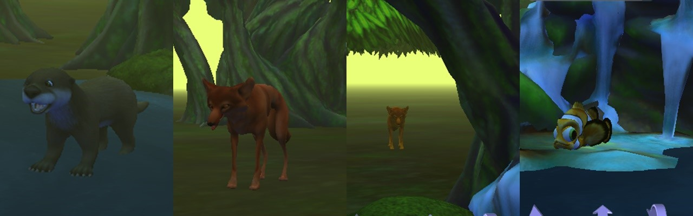
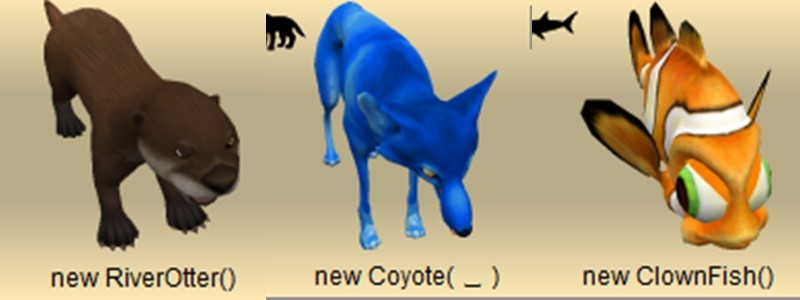
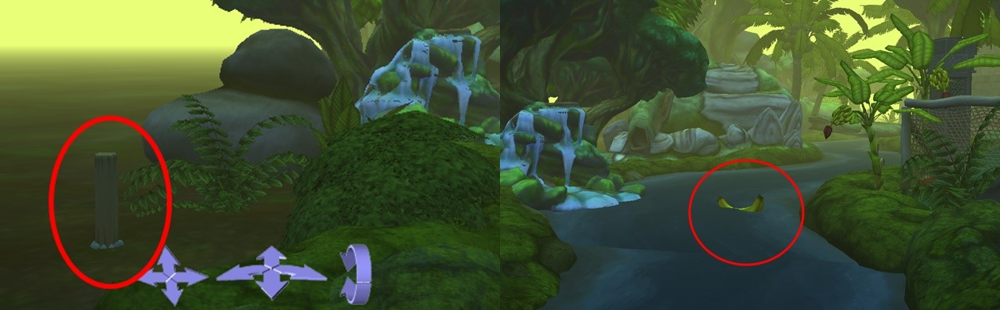
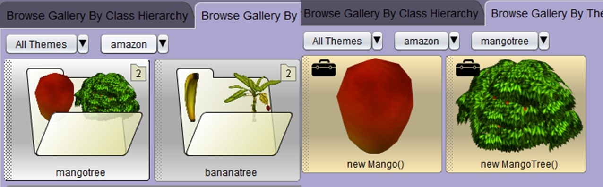
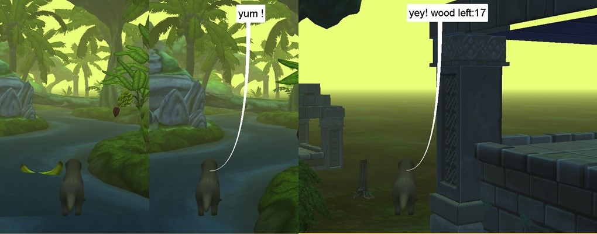
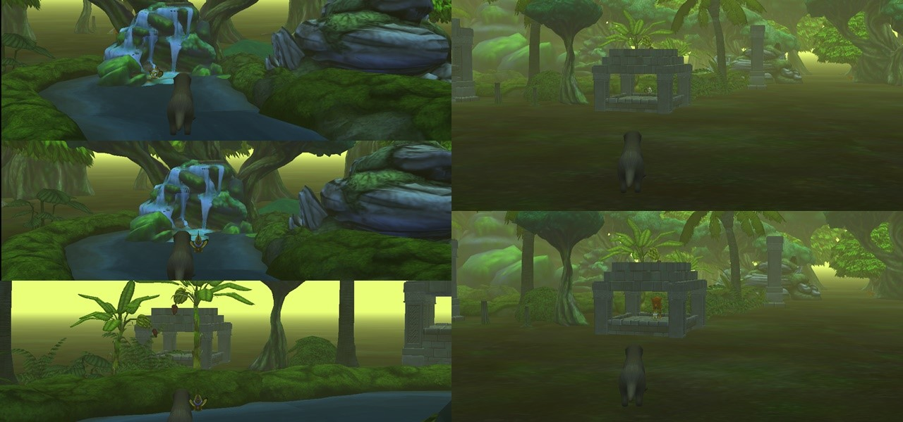
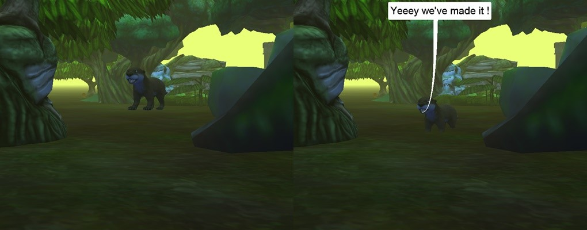

# Harry Otter and the Order of the Amazon

This is a little game made in [Alice 3.3](https://www.alice.org/) for a school project, using the Amazon start theme.

Harry Otter is the main protagonist of the game, a brave otter that needs to gather enough wood in the Amazonian Jungle to build a wooden house to be protected my the predators lurking around.

The game is made in a single map, the Amazonian Jungle, here is the top view of the map:

And this is a view of the maps from the characters level:

## Characters
The game has 4 characters:

- **Harry Otter** - the protagonist, he needs to gather wood and dodge the 2 coyotes. If he is touched by one of the coyotes, he dies and the game ends.
- **2 coyotes** - they follow Harry and want to catch him, but they cannot enter the water.
- **The fish**, the bait to trap the coyote

## Significant objects

- **The wood logs** that Harry needs to gather; there are 20 wood logs on the map, some of them hidden

- **Mangos and bananas** - Harry can eat mangoes and bananas; although they're not significant to the game, they are yum!

## How to play
There is a small story at the beginning of the game, that also features some close-ups of the most significant parts of the map, that the user needs to pay attention to.

Then the user can control the otter's movements on the map with the **up and down arrows**. The **J key** is used for jumping and the **T key** is used for turning 90 degrees left.

Harry must run from the coyotes and he can go in the water to evade them, as they are afraid to enter the water. If Harry is touched by a coyote, the games ends.

The second coyote is very fast and he stands right in the area where there are logs to be gathered, so Harry must trap the coyote to collect those logs. To do this, he must quickly get the fish bait from the waterfall and lure the coyote into the temple, where it'll remain stuck and Harry can go on with his mission.

To gather the wood logs and fruits, he simply needs to touch them.

The game is won when all 20 wood logs are collected.

